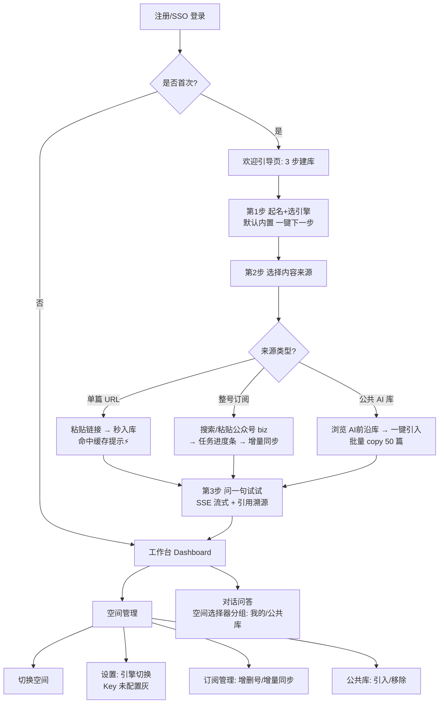

# SPEC-知识库平台化总设计（素材资产化 × 引擎可插拔 × 用户体验重建）

> 状态：已采纳为后续实现总纲 | 日期：2026-09-13 | 归属：`.docs/`
> 关系：本 SPEC 是 `SPEC-素材资产化与公共知识库.md`（资产/订阅/公共库）与 `ADR-0004`（引擎可插拔）的**整合总纲**，并新增 §六 用户体验流程（此前两份未覆盖的空白）。
> 已确认决策（2026-09-13）：① Notion 定为 CMS（导出归档目标），不进 RAG 引擎位；② 公共库默认**拷贝式**，引用式扇出列 M4；③ 建议执行顺序 P0→P1→P3→P2→P5→P4。

## 一、需求 → 设计映射

| 需求 | 设计承接 | 现状（2026-09-13 核实） |
|---|---|---|
| ① 单篇 vs 多号组库并存 | 素材资产化：抓取解析只做一次进 `ContentAsset`，空间只存 `KnowledgeDocument(asset→space)` 映射 | 单篇已通（`POST /spaces/{id}/docs`）；多号表已预埋未接线 |
| ② 公共 AI 库 | 公共库 = `is_public=1` 的 system 空间；用户"选用" = 批量 copy | `knowledge_spaces` 无 `is_public`，需迁移 |
| ③ 素材缓存可复用 | 资产全局缓存 + 幂等键 + content_hash 版本 | `content_assets` 已建，`ingest_url` 未接缓存 |
| ④ 可选引擎（coze/notion） | ADR-0004 引擎可插拔；Notion 定 CMS 不当引擎 | 端口未抽，引擎字段未迁移 |
| ⑤ 重新建立用户体验流程 | 本 SPEC §六：注册引导 → 三步建库 → 公共库引入 → 引擎切换 | 现状 5 页：首页即列表，无引导 |

## 二、核心架构（一句话）

> **抓取解析只做一次进 `ContentAsset` 全局缓存；`KnowledgeSpace` 只存 `KnowledgeDocument(asset_id→space_id)` 映射；公共 AI 库就是 `is_public=1` 的 system 空间；引擎是最后一层的可插拔插座（ADR-0004）。**

```
┌─────────── 采集层（只做一次）────────────┐
│ Source(biz) → ArticleManifest(清单)     │
│   → ContentAsset(markdown+hash 全局缓存) │
└─────────────────┬───────────────────────┘
                  │ asset_id 引用
┌─────────── 空间层（用户视角）────────────┐
│ KnowledgeSpace(engine, engine_kb_id)    │
│   → KnowledgeDocument(asset↔space 映射)  │
│   → 公共库 = system 空间 is_public=1     │
└─────────────────┬───────────────────────┘
                  │ upload / retrieve
┌─────────── 引擎层（ADR-0004 插座）───────┐
│ KnowledgeEnginePort                     │
│  ├ E0 内置(LangBot) ← 默认              │
│  ├ E1 主平台(RAGFlow 系)                │
│  ├ E2 Coze / E3 Dify / E4 FastGPT       │
└─────────────────────────────────────────┘
```

## 三、数据模型增量（1 个 Alembic 版本，复用现表）

现有 10 表（users/knowledge_spaces/sources/source_subscriptions/article_manifests/content_assets/knowledge_documents/jobs/job_items/bot_bindings）零改动复用，新增 5 字段：

```python
KnowledgeSpace.is_public: bool = False         # 公共库标记；公共库 owner 为 system 用户
KnowledgeSpace.owner_type: str = "user|system"
KnowledgeSpace.engine: str = "builtin"          # builtin|main|coze|dify|fastgpt（ADR-0004）
KnowledgeSpace.engine_kb_id: str = ""           # 引擎侧 KB 标识（与 langbot_kb_uuid 双写）
ContentAsset.hit_count: int = 0                 # 复用计数（热点与清理依据）
KnowledgeDocument.source: str = "copy|link"     # copy=拷贝入库(默认)；link=预留给 M4 扇出
```

纪律：`users.sub` 锚点不变；`uq_*` 幂等键不变；`FETCHED→INDEXED→READY` 状态机不变；余额/tier 不落库（ADR-0002）。

## 四、缓存与去重键（减少重复采集的关键）

| 层 | 键/函数 | 命中行为 |
|---|---|---|
| URL 归一 | `normalize_article_url()` + `is_short_link` 短链反解 | 非法 → 10006；短链直抓一次得 biz |
| 文章判定 | `has_article_anchors`（js_content/activity-name） | 缺失 → 20001 非文章页 |
| 资产 | `(source_id, external_id)` | 命中 READY 资产 → **微信 0 请求**，直接上传引擎 |
| 内容版本 | `content_hash(正文md)` | 号主改文 → version+1，旧 doc 标过期，不静默覆盖 |
| 原文 | `raw_uri(对象存储) + content_markdown` | 引擎上传失败可重传，不重抓微信 |
| 质量 | `score_quality ≥ 30` | 未达 → 20003 前置拦截，不入库 |

UI 约定：命中缓存提示「⚡ 命中缓存，秒入库」，`hit_count+1`。
**效果：第二个人采同一篇文章的成本 = 1 次 DB 命中 + 1 次引擎上传（LangBot KB 按空间隔离）。**

## 五、引擎可插拔（ADR-0004 摘要 + 决策）

- 端口：`create_kb / upload_file / ingest_status / retrieve / delete_kb / delete_file`
- 默认顺序：**内置 → 主平台(RAGFlow 系) → Coze → Dify → FastGPT**（按小白步数排序）
- 资产层与引擎解耦：`ContentAsset(content_markdown)` 是唯一真源；引擎只收文件/文本上传，不参与抓取解析；SaaS 缺 URL 上传时用 markdown 转文件兜底
- 密钥纪律：第三方 API Key 只走 env/密钥服务 + 用户级加密列，不入库明文、不入码
- **Notion 决策（已确认）**：列 CMS（存原文/元数据/导出归档目标），不当 RAG 引擎——Notion 检索 API 无语义检索/引用溯源，不适合中文知识库问答
- **公共库语义决策（已确认）**：默认**拷贝式**（copy 进用户空间 KB，问答只查单 KB，零架构改动）；引用式扇出（link/多库扇出）列 M4

## 六、用户体验流程（重建，本 SPEC 增量，v1.1 2026-09-13 补齐可落地细节）

**核心转变：从"工具"到"产品"——用户不再面对空列表，而是被引导 3 步建好第一个能回答问题的知识库。**
**设计原则：① 零基础可用（每页只有一个主按钮）；② 随时可回退（断点续做）；③ 慢操作必有进度（订阅/引入/轮询）；④ 缓存命中必显（⚡秒入库）；⑤ 引擎可换但默认不动（小白零感知）。**



### 6.1 五条用户旅程（验收脚本口径）

| 旅程 | 步骤（点击级） | 预期结果样子 |
|---|---|---|
| J1 小白单篇 | 登录→引导页→空间名默认"我的第一个知识库"→点"下一步"→选"粘贴一篇文章"→粘贴 URL→点"解析"（预览卡：标题/作者/质量分）→点"确认入库"→看到"⚡命中缓存，秒入库"或"入库中…"→点"问一句试试"→输入问题→看到流式回答+2 条引用 | 3 步内出现第一条可引用的回答；`202→READY→SSE meta/delta/done` |
| J2 多号组库 | 空间详情→"订阅公众号"→粘贴 biz/搜名称→点"订阅"→任务卡片出现进度条 `12/50`→`PARTIAL_SUCCESS` 时点"重试失败 3 篇"→完成后空间 `docCount+47` | `Job SUCCEEDED/PARTIAL`，`GET /jobs/{id}` 进度可轮询 |
| J3 公共库引入 | `/public` 浏览 `AI前沿库（50 篇·内置引擎）`→点"引入到我的空间"→选目标空间→进度条→引入完成提示"已引入 50 篇" | 本空间可问出公共库内容，`citations.spaceName=AI前沿库` |
| J4 引擎切换 | 空间设置→引擎下拉（内置✓/主平台/Coze 灰"未配置 Key 请联系管理员"）→切主平台→问同一问题→引用 `engine=main` | 未配 Key 引擎置灰不可点；切换后问答正常 |
| J5 断点续做 | 做到第 2 步刷新页面→回到引导页显示"上次做到第 2 步，继续" | `GET /onboarding/steps` 返回进度 |

### 6.2 页面结构（前端 5 页 → 8 页，每页 UI 规格）

| 页面 | 布局与组件 | 主按钮/反馈 | 空/错/加载态 |
|---|---|---|---|
| `/onboarding` 引导页（新） | 顶部步骤条 `1 起名→2 选来源→3 提问`；第1步：空间名输入（默认值）+引擎卡片（内置默认选中，主平台/Coze/Dify/FastGPT 置灰+tooltip）；第2步：三张来源卡片（单篇/整号/公共库）；第3步：问答试用框 | 每步单一主按钮"下一步"；第2步三种来源任选一即亮"下一步" | 刷新断点续做横幅；引擎未配 Key 显示"联系管理员配置" |
| `/` 工作台（改造） | 空间卡片（名/docCount/引擎徽标/更新时间）+ 快捷动作（问一问/加文章）+ 公共库推荐位（AI前沿库卡） | 空态 CTA"创建第一个知识库"而非裸列表 | 加载骨架卡；列表失败给重试 |
| `/spaces` 列表（改造） | 分组：我的空间 / 公共库；每行引擎角标 `⚙️内置/Coze` | 点卡进详情 | 空组提示文案 |
| `/spaces/[id]` 详情（改造） | 文档列表（标题/来源/状态徽标 pending/ready/failed/来源标注「缓存/新抓」）+ 顶部"添加文章/订阅公众号/引入公共库"三入口 + 设置抽屉（引擎切换） | 入库按钮 loading"解析中…/入库中…"；缓存命中 toast"⚡命中缓存，秒入库" | 20003 低质拦截卡（reasons 列表+换链按钮）；30003 失败卡+重试 |
| `/chat` 问答（改造） | 空间选择器分组（我的/公共库）；消息流（用户右/助手左含引用）；错误气泡+重试；401 回落首页 | 发送中禁用输入框，`asking` 守卫防双发 | 空态引导"开始向机器人提问"；流中断（无 done）标记"内容可能不完整，请重试"（`api.ts:825`）；401 自动 `router.replace("/")` |
| `/subscriptions` 订阅管理（新） | 订阅列表（号名/biz/同步策略/下次同步）+ 任务进度条 + 失败项重试 | "订阅公众号"主按钮；`PARTIAL` 显示"重试失败 N 篇" | 空订阅引导；同步失败 30005 文案 |
| `/engines` 引擎设置（新） | 5 引擎卡片（内置/主平台/Coze/Dify/FastGPT）+ Key 状态点（绿已配/灰未配） | 未配 Key 卡片置灰不可选 | 切换确认模态（"切换后新入库走新引擎，旧文档不动"） |
| `/public` 公共库（新） | 公共库卡（50 篇/引擎/更新时间）+ 引入按钮 + 引入进度 | "引入到我的空间"→选空间下拉→进度条 | 已引入显示"已引入✓"防重复 |

### 6.3 关键交互细节（防呆）

1. 轮询：`pollDocStatus 1.5s/80 次` 上限，超时按 30003 文案+重试；`Job` 订阅进度 `5s` 轮询。
2. 幂等：预览卡质量达标时显示"同一链接重复提交将覆盖并重新入库。"（`AddArticlePanel.tsx:288`）。
3. 问答：`meta` 先渲染来源区，`delta` 累积，`done` 收敛；`error` 帧保留已发正文叠加展示；`abort`（切空间/卸载）静默不误报 50002。
4. 移动端：引导页步骤条横滑；卡片单列；输入区吸底。

### 6.4 UX 验收清单（每页对照打勾）

```text
□ 新用户 3 步建库走通（J1），刷新断点续做（J5）
□ 单篇缓存命中 toast ⚡（P0），文档行标注 缓存/新抓
□ 订阅进度条+PARTIAL 重试（J2），公共库引入 50 篇（J3）
□ 引擎未配 Key 置灰（J4），citations 含 {title, spaceName, engine}
□ 空/加载/错误/成功四态齐全；mock e2e 3456 隔离通过；3333 唯一零 3334/3335
```

## 七、API 增量（v1 下 12 个，`ingest_doc {url}` 不动）

```text
# 引擎（ADR-0004）
GET   /api/v1/engines                          # 引擎位 + Key 可用性
PATCH /api/v1/spaces/{id}/engine               # 切换引擎 {engine: builtin|main|coze|dify|fastgpt}

# 信息源/订阅（SPEC P2）
POST  /api/v1/sources                          # 注册公众号 {biz|profile_url}
GET   /api/v1/sources?type=wechat_oa
POST  /api/v1/spaces/{id}/subscriptions        # 订阅整号 {source_id, sync_policy}
GET   /api/v1/spaces/{id}/subscriptions
POST  /api/v1/jobs/{id}/retry                  # 单篇重试（30005 PARTIAL_SUCCESS）

# 公共库（SPEC P1）
GET   /api/v1/spaces/public                    # 公共库列表（is_public=1 系统空间）
POST  /api/v1/spaces/{id}/links                # 引入公共库 {public_space_id}（批量 copy）

# 引导（UX 增量）
GET   /api/v1/onboarding/steps                 # 引导页状态/进度（断点续做）
```

空间视图追加：`engine`（默认 builtin）、`engineKbId`、`isPublic`；问答 `citations` 追加 `engine`。
错误码复用 `10006/20001/20002/20003/30003`，整号级新增 `30005 PARTIAL_SUCCESS`（Job 级）。

## 八、分步落地（每步可对照检查）

| 阶段 | 内容 | 周期 | 完成标准 |
|---|---|---|---|
| **P0 资产缓存** | `ingest_url` 先查 `ContentAsset` 再抓；`raw_uri` 落对象存储 | 1 周 | 同一 URL 二次入库微信 0 请求，`hit_count=2`；ruff/mypy/pytest 全绿（含复用单测 +3）；`evidence/p0_asset_cache_*.txt` |
| **P1 公共库拷贝式** | 迁移 5 字段 + `GET /spaces/public` + `POST /links` 批量 copy + 前端"公共库"分组 | 1 周 | 新用户一键引入 AI 库 50 篇，202→READY，`SSE citations.spaceName=AI前沿库`；`evidence/p1_public_*.txt` |
| **P2 整号订阅** | `SourceSubscription + Manifest Diff + Job/JobItem worker` + 订阅管理页 | 2 周 | 订阅 1 号，Job SUCCEEDED/PARTIAL，进度条 + 单篇重试可用；`evidence/p2_subscription_*.txt` |
| **P3 引擎端口抽取** | `KnowledgeEnginePort(Protocol)` + `LangBotAdapter` 搬运现状调用 | 3 天 | 行为零变更；pytest 158+2skip 全绿；202→READY→SSE 回归一致；`evidence/adr0004_p0_*.txt` |
| **P4 引擎接入** | 迁移 `engine/engine_kb_id`（双写）+ 主平台 RAGFlow 系 + Coze→Dify→FastGPT 逐个接 | 2-4 周 | 切换引擎即问答；citations 标注 engine；每家 `evidence/adr0004_p3_*.txt` |
| **P5 UX 重建** | 引导页 + 工作台改造 + 订阅/引擎/公共库页 | 2 周 | 新用户 3 步建库全流程走通（前置 P1/P2）；onboarding 断点续做 |

**建议执行顺序：P0 → P1 → P3 → P2 → P5 → P4**
（先缓存去重省成本 → 公共库见效快 → 引擎端口先行给 P4 让出插槽 → 整号订阅 → UX 收尾 → SaaS 引擎按 Key 到位逐个开）

## 九、验收与证据（每阶段通用）

- 门禁：ruff / mypy / pytest / tsc / vitest 全绿
- 运行：202→READY→SSE 帧级验证；端口 3333 唯一（AGENTS.md 铁律）
- 缓存验证：抓包/日志证明微信 0 请求（P0 起每次验收必含）
- 清理：探针空间可删；证据落 `.workbuddy/evidence/p{0,1,2,3,4,5}_*.txt`，台账登记
